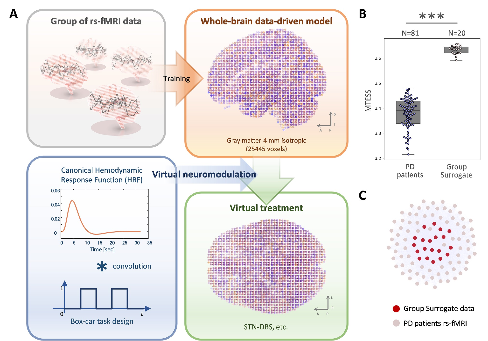
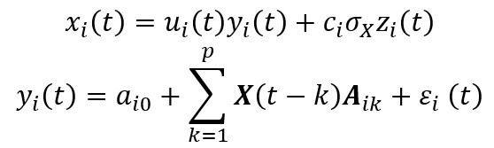

# Virtual Neuromodulation Toolbox
The Virtual Neuromodulation Toolbox for MATLAB (Python version is [here](https://github.com/takuto-okuno-riken/vneumodpy))

## Introduction
To realize the digital brain, various approaches have been taken at multiple levels.
We proposed [Group Surrogate Data Generating Model (GSDGM)](https://github.com/takuto-okuno-riken/mtess), which does not incorporate structural connectivity and focuses on reproducing resting-state functional MRI dynamics (BOLD signal). 
This model can learn multivariate time-series data (BOLD signal) of a group and generate a centroidal and representative multivariate time-series of the group.
The group surrogate model preserves the statistics of multivariate time-series well, so this allows for the generation of whole-brain dynamics with extremely high accuracy. 

Whole-brain data-driven model (group surrogate model) assumes no specific brain tissue structure, one voxel of 4 × 4 × 4 mm gray matter, and 25445 voxels based on the Allen human brain atlas. 
All voxels are fully connected, and vector auto-regression (VAR) surrogate is used to learn group data and generate group surrogate data.

 

Then, we extended output of VAR surrogate for virtual neuromodulation.

where xi(t) is output of voxel i, yi(t) is VAR surrogate output of voxel i, zi(t),ui(t) is modulation term of voxel i, and ci,σX∈R. 
σX is calculated as the standard deviation from the entire voxel time-series.
zi(t) is constructed by convolution of the canonical Hemodynamic Response Function (HRF) and the Box-car task design.
ui(t) performs direct adjustment to the output of VAR surrogate.
In other words, if there is a virtual neuromodulation stimulus, it adjusts to prioritize neuromodulation stimulus, such as ui(t)=1-0.5∙zi(t).
Using the above-mentioned virtual neuromodulation, BOLD signal addition, i.e., DBS treatment, can be virtually performed for specific voxels. 

<b>Command line tools</b>

| name | description |
|:---|:---|
| gsdgm | Generate a whole-brain data-driven model based on the group surrogate model (VAR surrogate).|
| vneumod | Generate virtual neuromodulation time-series surrogate data based on the group surrogate model.|
| mtess | Calculate and plot MTESS for a group of multivariate time-series data. |

## Requirements: Software
* MATLAB R2019b or later
* Deep Learning Toolbox ver12.1 or later
* Fuzzy Logic Toolbox ver2.6 or later
* Econometrics Toolbox ver5.3 or later
* Parallel Computing Toolbox ver7.1 or later
* [VARDNN Toolbox](https://github.com/takuto-okuno-riken/vardnn)

Please download the [VARDNN Toolbox](https://github.com/takuto-okuno-riken/vardnn) and "Add Path" in the MATLAB before using Virtual Neuromodulation toolbox.

## Command Line Tools Demos
<b>Demo 1</b> 

## Command Line Tools Reference
<b>gsdgm command</b> 
~~~
>> gsdgm -h
model training : gsdgm [options] file1.mat file2.mat ...
  -v, --var           output Vector Auto-Regression (VAR) group surrogate model (<filename>_gsm_var.mat)
  -p, --pcvar         output Principal Component VAR (PCVAR) group surrogate model (<filename>_gsm_pcvar.mat)
  -d, --vardnn        output VAR Deep Neural Network (VARDNN) group surrogate model (<filename>_gsm_vardnn.mat)
  --lag num           time lag <num> for VAR, PCVAR, VARDNN surrogate model (default:1)
  --noise type        noise type for VAR, PCVAR, VARDNN surrogate model (default:"gaussian" or "residuals")
  --outpath path      output files <path> (default:"results")
  --transform type    input training signal transform <type> 0:raw, 1:sigmoid (default:0)
  --transopt num      signal transform option <num> (for type 1:centroid value)
  --format type       output surrogate data file format <type> 0:csv, 1:mat (default:1)
  --surrnum num       output surrogate sample number <num> (default:0)
  --siglen num        output time-series length <num> (default:same as input time-series)
  --range type        output surrogate value range (default:"auto", sigma:<num>, full:<num>, <min>:<max> or "none")
  --pcrate num        principal component variance rate <num> for PCVAR surrogate (default:0.99)
  --epoch num         VARDNN surrogate training epoch number <num> (default:1000)
  --showinsig         show input time-series data of <filename>.csv
  --showinras         show raster plot of input time-series data of <filename>.csv
  --showsig           show output surrogate time-series data
  --showras           show raster plot of output surrogate time-series data
  --verbose           show verbose
  --version           show version number
  -h, --help          show command line help
~~~
The input .mat file should include input cell data described as follows. The node count must be the same within the group, whereas the time-series length does not have to be the same.
| name | cell | description |
|:---|:---|:---|
|CX |{&lt;nodes&gt; x &lt;length&gt;} x &lt;cell number&gt; |group of multivariate time-series|
|names |{'data name string'} x &lt;cell number&gt; |names of each time-series data|

The output (group surrogate model) .mat file includes the following struct data:

| name | type | description |
|:---|:---|:---|
|net | struct |struct of group surrogate model|
|gRange | struct |struct of group range information|
|name | string |name of group surrogate model|

##
<b>vneumod command</b> 
~~~
>> vneumod -h
usage: vneumod [options] [permfile.mat ...]
  -c, --cx name       set cells of subject time-series (<filename>.mat)
  -m, --model name    set (VAR) group surrogate model (<filename>_gsm_var.mat)
  -a, --atlas name    set cube atlas nifti file (<filename>.nii.gz)
  -t, --targatl name  set modulation target atlas nifti file (<filename>.nii.gz)
  -i, --roiidx name   set modulation target ROIidx file (<filename>.mat)
  -r, --roi num       set modulation target ROI <num> or <range text>
  -o, --out num       set output perm & surrogate files number <num> (default:1)
  --surrnum num       output surrogate sessions per one file <num> (default:40)
  --srframes num      output surrogate frames <num> (default:160)
  --vnparam num num num  set virtual neuromodulation params <num num num> (default:28 22 0.15)
  --tr num               set TR (second) of fMRI time-series <num> (default:1)
  --hrfparam num num     set HRF (for convolution) params <num num> (default:16 8)
  --glm               output GLM result nifti file.
  --outpath path      output files <path> (default:"results")
  --nocache           do not output surrogate file
  --pymodel path      set (VAR) group surrogate model <path> by vneumodpy (Python)
  --version           show version number
  -h, --help          show command line help
~~~
The input .mat files are optional. It should include subject permutation data for surrogate data generation:
| name | matrix | description |
|:---|:---|:---|
|perm |&lt;1&gt; x &lt;length&gt; | time-series permutation order|

The output will be T-value 3D matrix nifti file (GLM result) aligned with cube atlas nifti file.

##
<b>mtess command</b> 
~~~
>> mtess -h
usage: mtess [options] file1.mat file2.mat ...
  --range type        input group value range (default:"auto", sigma:<num>, full:<num> or <min>:<max>)
  --pcc type          Partial Cross-Correlation algorithm 0:auto, 1:PCC, 2:SV-PCC, 3:PC-PCC, 4:[] (dafault:0)
  --aclag num         time lag <num> for Auto Correlation (default:5)
  --paclag num        time lag <num> for Partial Auto Correlation (default:13)
  --cclag num         time lag <num> for Cross Correlation (default:2)
  --pcclag num        time lag <num> for Partial Cross Correlation (default:4)
  --lambda num        ridge regression param <num> for Partial Cross Correlation (default:0)
  --outpath path      output files <path> (default:"results")
  --format type       save file format <type> 0:csv, 1:mat (default:1)
  --transform type    input signal transform <type> 0:raw, 1:sigmoid (default:0)
  --transopt num      signal transform option <num> (for type 1:centroid value)
  --showinsig         show input time-series data of <filename>.csv
  --showinras         show raster plot of input time-series data of <filename>.csv
  --showmat           show result MTESS matrix
  --showsig           show 1 vs. others node signals
  --showprop          show result polar chart of 1 vs. others MTESS statistical properties
  --shownode          show result line plot of 1 vs. others node MTESS
  --showdend algo     show dendrogram of <algo> hierarchical clustering based on MTESS matrix. see MATLAB linkage method option.
  --showforce         show force weight effect graph based on MTESS matrix
  --cache             use cache file for MTESS calculation (low memory mode)
  --cachepath path    cache files <path> (default:"results/cache")
  -v, --version       show version number
  -h, --help          show command line help
~~~
The input .mat file should include input cell data. The node count must be the same within the group, whereas time-series length does not have to be the same.
| name | cell | description |
|:---|:---|:---|
|CX |{&lt;nodes&gt; x &lt;length&gt;} x &lt;cell number&gt; |group of multivariate time-series|
|names |{'data name string'} x &lt;cell number&gt; |names of each time-series data|

The output .mat file includes the following matrix data:

| name | matrix | description |
|:---|:---|:---|
|MTS |&lt;cell number&gt; x &lt;cell number&gt; | MTESS matrix (2D)|
|MTSp |&lt;cell number&gt; x &lt;cell number&gt; x 8| MTESS statistical property matrix (3D)|
|nMTS |&lt;cell number&gt; x &lt;cell number&gt; x &lt;nodes&gt;| Node MTESS matrix (3D)|
|nMTSp |&lt;cell number&gt; x &lt;cell number&gt; x &lt;nodes&gt; x 8| Node MTESS statistical property matrix (4D)|

Similarities are generated for the following 8 statistical properties: mean, standard deviation, DFT amplitude, correlation, partial correlation, cross-correlation and partial cross-correlation.

## Citing Virtual Neuromodulation Toolbox
If you find Virtual Neuromodulation Toolbox useful in your research, please cite it as follows: 

Takuto Okuno, Alexander Woodward, Hideyuki Okano, Junichi Hata (20XX)
["A digital brain study: Is deep brain stimulation activating associative circuit?"](https://www.google.com/), ,

